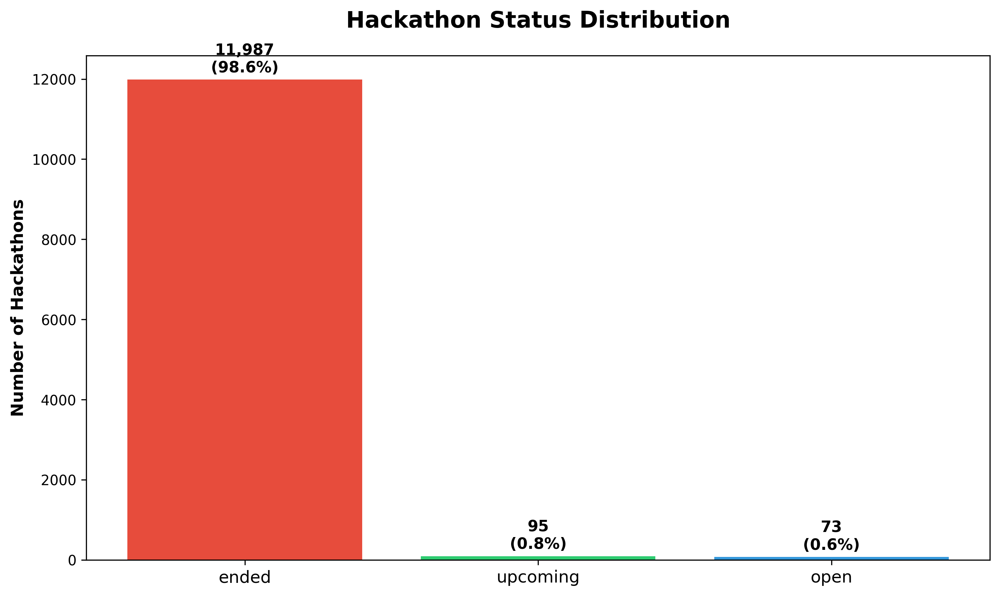
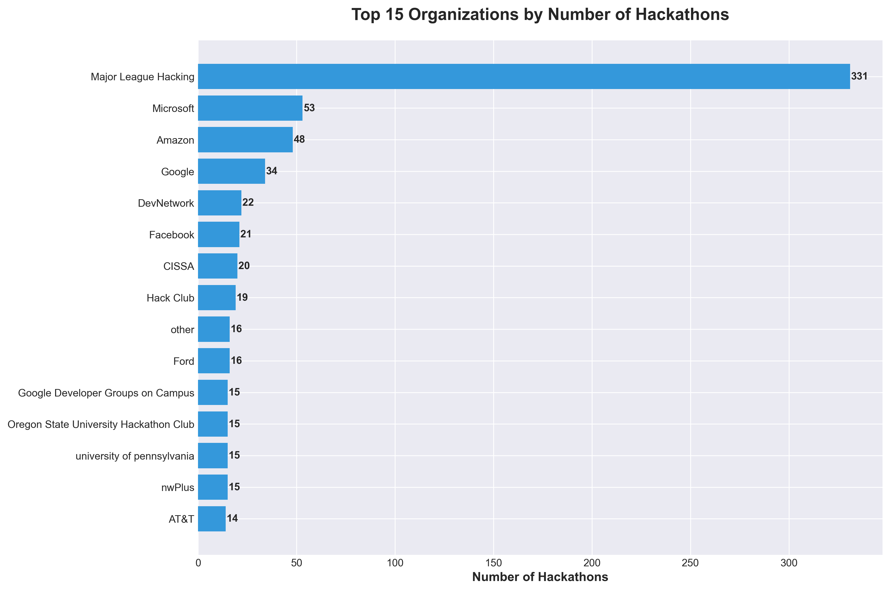
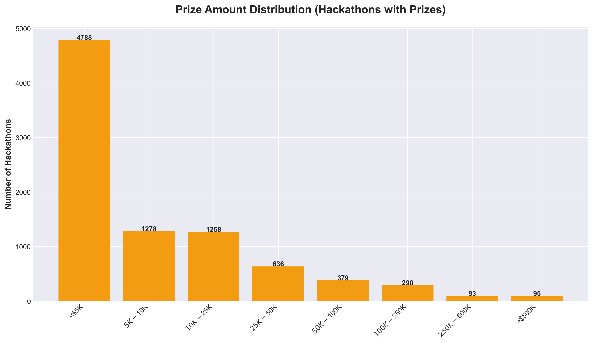
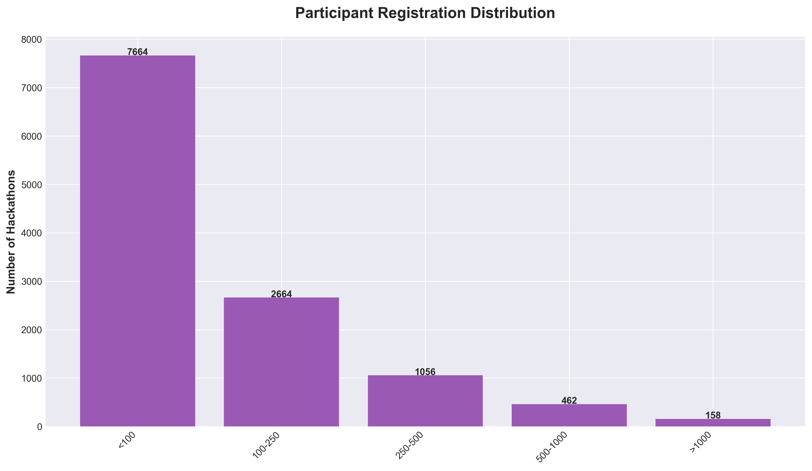
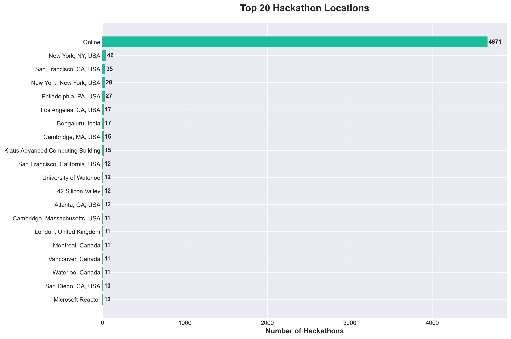
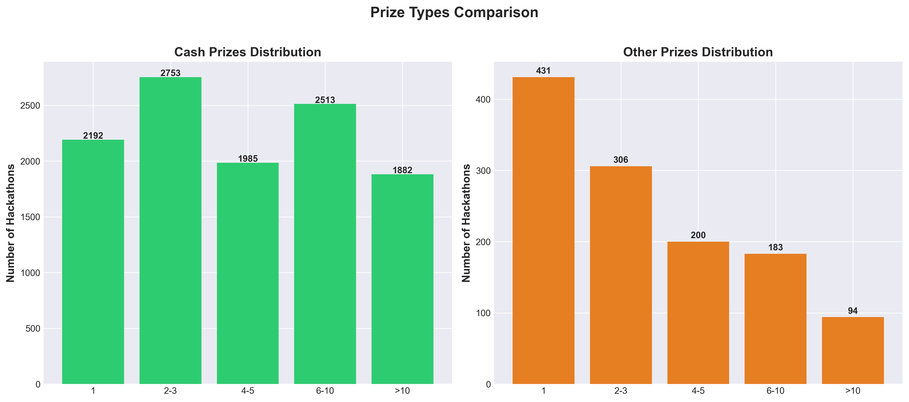
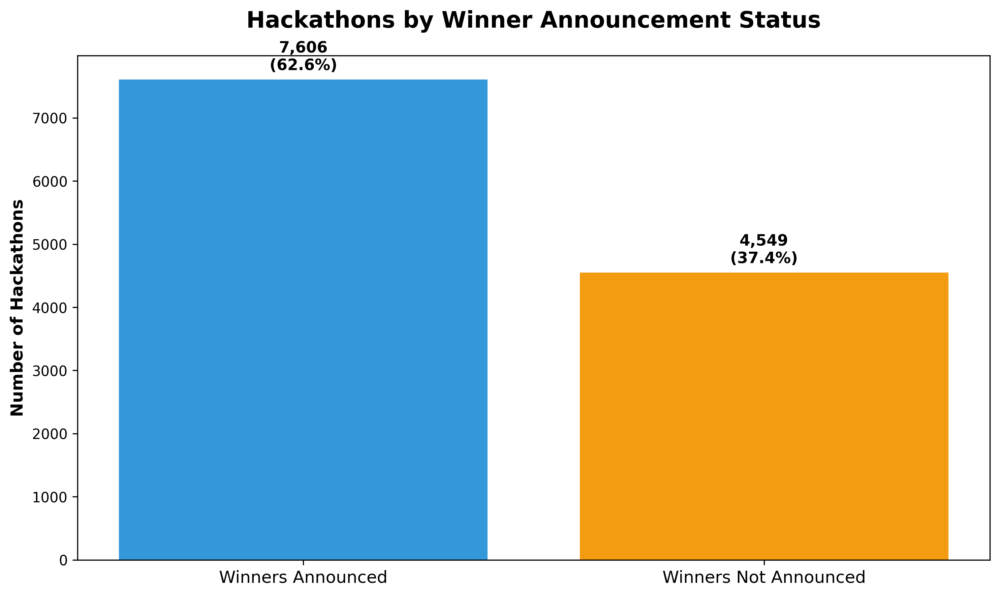
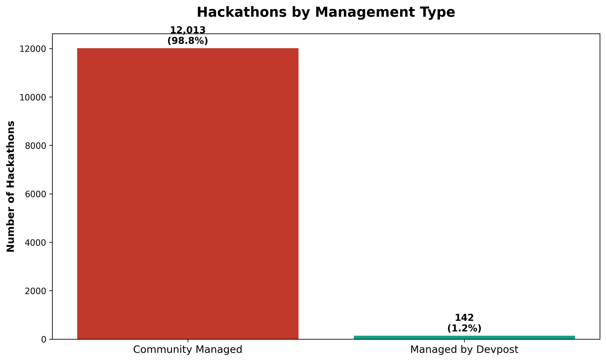

# Devpost Hackathons Data Analysis

A comprehensive analysis of **12,155 hackathons** from Devpost.com, featuring detailed visualizations and insights into the global hackathon landscape.

## 📊 Overview

This project collects and analyzes hackathon data from Devpost using their public API. The dataset includes information about prizes, participants, themes, locations, and organizing institutions.

### Key Statistics

- **Total Hackathons**: 12,155
- **Hackathons with Prizes**: 8,827 (72.6%)
- **Total Participants**: 2.28M+ registrations
- **Average Prize**: $36,465
- **Highest Prize**: $12.7M

---

## 📈 Data Visualizations

### 1. Hackathon Status Distribution



**Insight**: The vast majority of hackathons in the database (99.4%) are closed/completed events, with only 73 currently open hackathons. This reflects Devpost's extensive historical archive.

---

### 2. Top Organizations



**Key Findings**:
- **Major League Hacking (MLH)** leads by a significant margin with 331 hackathons
- **Microsoft** (53) and **Amazon** (48) are the top corporate sponsors
- Tech giants dominate: Google, Facebook, IBM all in top 10
- University hackathons form a significant portion (MIT, NYU, Penn)

**Insight**: MLH's dominance shows their role as the central organizing body for student hackathons worldwide, while tech companies use hackathons as recruitment and innovation tools.

---

### 3. Most Popular Themes


**Top Themes**:
1. **Beginner Friendly** (3,909) - Nearly 1/3 of all hackathons
2. **Social Good** (2,641) - Strong focus on positive impact
3. **Machine Learning/AI** (2,074) - Fastest growing category
4. **Open Ended** (2,065) - Encouraging creativity
5. **Web** (2,059) - Traditional hackathon focus

**Insight**: The prevalence of "Beginner Friendly" theme indicates hackathons' role in education and talent development. The strong showing of AI/ML reflects current industry trends, while "Social Good" shows the community's commitment to positive societal impact.

---

### 4. Prize Distribution



**Prize Breakdown**:
- **<$5K**: 2,931 hackathons (33.2%)
- **$5K-$10K**: 1,857 hackathons (21.0%)
- **$10K-$25K**: 2,105 hackathons (23.8%)
- **$25K-$50K**: 987 hackathons (11.2%)
- **$50K-$100K**: 501 hackathons (5.7%)
- **>$100K**: 446 hackathons (5.1%)

**Financial Insights**:
- Median prize: $4,300
- Average prize: $36,465 (skewed by high-value hackathons)
- Total prize pool across all hackathons: ~$321M+

**Insight**: While most hackathons offer modest prizes (<$10K), there's a long tail of high-value corporate hackathons (>$100K) that significantly raise the average. This creates opportunities for both beginners and professional developers.

---

### 5. Participant Registration Distribution



**Participation Patterns**:
- Most hackathons (64%) attract fewer than 250 participants
- Mid-size hackathons (250-1K): 25%
- Large hackathons (>1K): 11%
- Largest hackathon: 128,522 participants

**Insight**: The majority of hackathons are intimate events (<250 participants), fostering close collaboration and mentorship. However, major corporate hackathons can attract massive participation, indicating strong interest in tech innovation.

---

### 6. Global Distribution



**Geographic Insights**:
- **Online** hackathons dominate (4,671 - 38.4%)
- **Major Tech Hubs**: San Francisco (35), New York (46), Seattle (23)
- **International**: London (22), Toronto (21), Bangalore (20)
- **Universities**: Waterloo (19), Berkeley (16)

**Insight**: The shift to online hackathons (accelerated by COVID-19) has democratized access, allowing global participation. However, traditional tech hubs still host numerous in-person events, maintaining their role as innovation centers.

---

### 7. Featured Hackathons


**Insight**: Only 0.04% of hackathons are featured on Devpost, indicating a highly selective curation process. Featured hackathons typically have major sponsors, significant prizes, and broad appeal.

---

### 8. Prize Types Comparison



**Prize Structure**:
- **Cash Prizes**: Most hackathons offer 1-3 cash prizes
- **Other Prizes**: API credits, hardware, subscriptions, and swag
- Cash prizes remain the primary incentive

**Insight**: While cash is king, many hackathons supplement with valuable non-monetary prizes (AWS credits, hardware like Oculus Quest, software licenses) that can be more valuable for early-stage projects.

---

### 9. Winner Announcements



**Insight**: 62.6% of hackathons have announced winners, with the remainder either still in judging, ongoing, or abandoned. This high completion rate demonstrates Devpost's effectiveness as a platform for managing hackathon lifecycles.

---

### 10. Management Type



**Insight**: 98.8% of hackathons are community-managed, showing Devpost's role as an infrastructure provider rather than event organizer. This decentralized model empowers diverse organizations to host hackathons.

---

## 🔍 Key Insights & Trends

### Industry Trends
1. **AI/ML Dominance**: Machine Learning/AI is the 3rd most popular theme, reflecting the industry's focus on artificial intelligence
2. **Social Impact**: "Social Good" ranks #2, showing hackers want to create positive change
3. **Education Focus**: "Beginner Friendly" is #1, emphasizing hackathons' role in developer education

### Organizer Patterns
- **Corporate Sponsors**: Tech companies use hackathons for recruiting and innovation
- **Universities**: Major schools (MIT, Stanford, Berkeley) host regular hackathons for students
- **MLH Network**: Dominates student hackathon space with consistent, high-quality events

### Financial Landscape
- Prize amounts vary widely ($100 to $12.7M)
- Median prize ($4.3K) is significantly lower than average ($36.5K)
- Most hackathons are accessible with modest funding

### Geographic Distribution
- Online hackathons enable global reach
- Physical events concentrate in tech hubs
- International expansion growing (India, UK, Canada)

### Participation Dynamics
- Most events are intimate (< 250 people)
- Large corporate hackathons can exceed 100K participants
- Average participant count: 188

---

## 🛠️ Technical Implementation

### Data Collection
- **Source**: Devpost Public API
- **Method**: Async Python script with `aiohttp`
- **Scale**: 12,155 hackathons across 1,351 API pages
- **Concurrency**: 10 simultaneous requests with retry logic
- **Duration**: ~7-8 minutes for full dataset

### Technologies Used
- **Python 3.10+**: Core scripting
- **aiohttp**: Async HTTP requests
- **pandas**: Data manipulation
- **matplotlib & seaborn**: Visualization
- **CSV**: Data storage format

### Project Structure
```
devpost_com/
├── fetch_hackathons.py          # Async data collection script
├── generate_charts.py            # Visualization generation
├── devpost_hackathons.csv       # Complete dataset (4.1 MB)
├── charts/                       # Generated visualizations
│   ├── 01_status_distribution.png
│   ├── 02_top_organizations.png
│   ├── 03_popular_themes.png
│   ├── 04_prize_distribution.png
│   ├── 05_registration_distribution.png
│   ├── 06_location_distribution.png
│   ├── 07_featured_distribution.png
│   ├── 08_prize_types_comparison.png
│   ├── 09_winners_announced.png
│   └── 10_management_type.png
└── README.md                     # This file
```

---

## 📝 Dataset Fields

The CSV dataset includes 18 fields per hackathon:

| Field | Description |
|-------|-------------|
| `id` | Unique hackathon identifier |
| `title` | Hackathon name |
| `url` | Devpost hackathon page URL |
| `organization_name` | Hosting organization |
| `location` | Physical or "Online" |
| `open_state` | "open" or "closed" |
| `submission_period_dates` | Start and end dates |
| `time_left_to_submission` | Remaining time (if open) |
| `prize_amount` | Total prize pool |
| `cash_prizes_count` | Number of cash prizes |
| `other_prizes_count` | Number of non-cash prizes |
| `registrations_count` | Total participants |
| `themes` | Comma-separated themes |
| `featured` | Featured on Devpost homepage |
| `winners_announced` | Winners declared |
| `invite_only` | Private/invitation-only |
| `managed_by_devpost` | Managed by Devpost team |
| `thumbnail_url` | Event image |
| `submission_gallery_url` | Project submissions page |

---

## 🚀 Usage

### Fetch Latest Data
```bash
python3 fetch_hackathons.py
```

### Generate Visualizations
```bash
python3 generate_charts.py
```

### Requirements
```bash
pip3 install aiohttp pandas matplotlib seaborn
```

---

## 📊 Sample Data

```csv
id,title,organization_name,location,prize_amount,registrations_count,themes
26670,AI Partner Catalyst: Accelerate Innovation,Google,Online,"$75,000",4738,"Machine Learning/AI, Databases, Open Ended"
26711,Codegeist 2025,Atlassian,Online,"$120,000",3268,"Machine Learning/AI, Enterprise, Productivity"
27287,Tableau Hackathon,Tableau,Online,"$45,000",1521,"Databases, Enterprise, Machine Learning/AI"
```

---

## 🎯 Future Enhancements

- **Time-series analysis**: Track hackathon trends over time
- **Network analysis**: Organization collaboration patterns
- **Predictive modeling**: Success factors for hackathons
- **Real-time dashboard**: Live data updates
- **Sentiment analysis**: Analyze project descriptions
- **Winner analysis**: Common traits of winning projects

---

## 📄 License

Data sourced from Devpost's public API. This analysis is for educational and research purposes.

---

## 🤝 Contributing

Feel free to:
- Add new visualizations
- Improve data collection
- Suggest analyses
- Report issues

---

## 📧 Contact

For questions or collaboration opportunities, please open an issue on GitHub.

---

**Last Updated**: December 2025
**Data Version**: 12,155 hackathons
**Coverage**: 2008-2025

---

<p align="center">
  <i>Empowering the hackathon community through data-driven insights</i>
</p>
